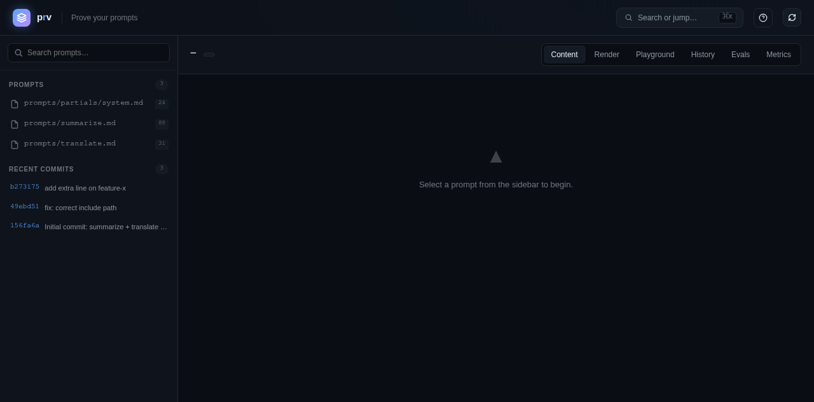
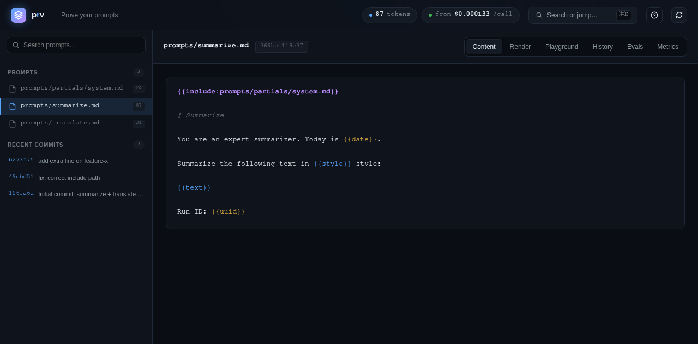
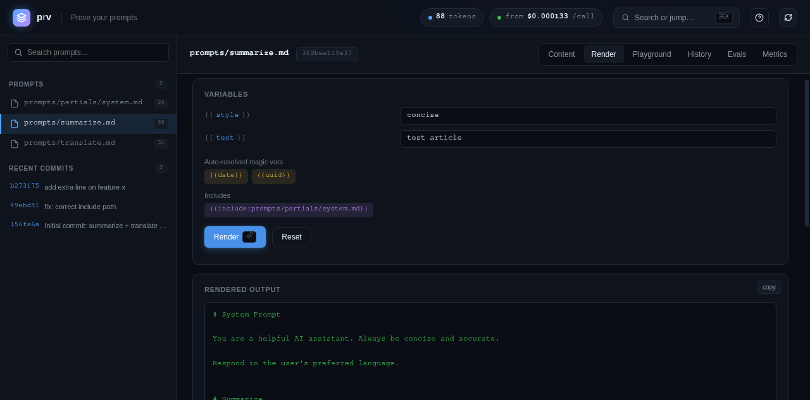
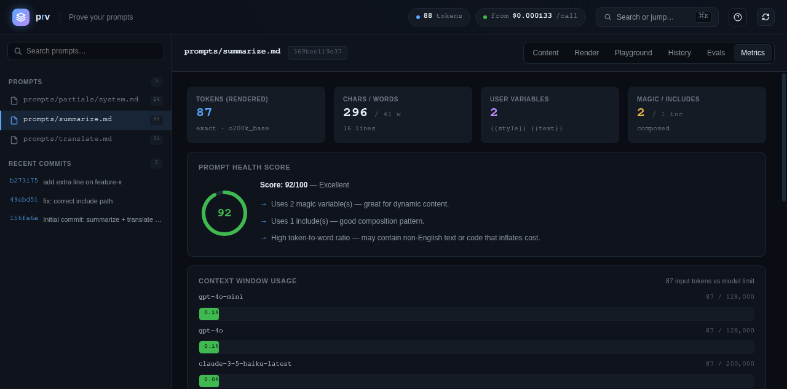
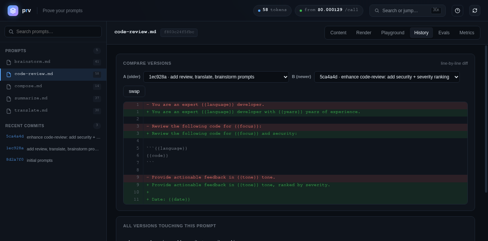

# prv

<p align="center">
  
</p>

<p align="center">
  <strong>Prove your prompts.</strong> Git for AI prompts — version, diff, branch, evaluate, and roll back. Local-first, blazingly fast.
</p>

<p align="center">
  
</p>

<p align="center">
  <a href="https://github.com/lululuhu/prv/actions/workflows/ci.yml"></a>
  <a href="LICENSE"></a>
  <a href="https://crates.io/crates/prv"></a>
  
  <a href="https://github.com/lululuhu/prv/stargazers"></a>
</p>

---

You tweak a prompt 40 times a day. You paste it into ChatGPT, it kind of works, you change one word, it works better — and tomorrow you have **no idea which version was the good one**, no diff between "v3 final" and "v3 final FINAL", and a folder full of `prompt_old.txt`, `prompt_old2.txt`, `prompt_REALLY_final.txt`.

prv fixes this. It's `git`, but purpose-built for prompts.

## 🖼️ Web GUI preview

Launch the built-in Web GUI with `pv serve`, then open `http://127.0.0.1:6174` in your browser.

<p align="center">
  
</p>

<p align="center"><sub>Content tab — syntax-highlighted prompt template with magic vars and includes</sub></p>
<p align="center">
  
</p>

<p align="center"><sub>Render tab — inline variable editor + rendered output</sub></p>
<p align="center">
  
</p>

<p align="center"><sub>Metrics tab — token count, health score ring, context window bars, cost comparison chart</sub></p>
<p align="center">
  
</p>

<p align="center"><sub>History tab — line-by-line version diff between any two commits</sub></p>
<p align="center">
  
</p>

```bash
pv add prompts/summarize.md
pv commit -m "refine: summarize now reports tone + title"
pv diff          # see exactly what changed since the last good version
pv log           # walk back through every iteration
```

> **Why not just use git?** You can — and prv borrows git's model (content-addressed objects, trees, commits). But prompts live next to code, mixed into repos, notebooks, and chat exports. prv is a focused, prompt-native tool: it tracks `.txt/.md/.prompt/.j2/.yaml`, lives in a `.pv/` folder that won't collide with your code repo, and is built for the *iterate-and-compare* workflow that prompt engineering actually is.

## ✨ Features

- **Snapshots** — commit prompt versions with messages, just like git.
- **Semantic diff** — line-level `+`/`-` diff so you can see *exactly* which instruction you changed. `pv diff --stat` for a one-line summary per file.
- **Branches & merging** — `pv branch experiment` → `pv checkout experiment`. Switch branches and the working tree restores instantly. `pv merge experiment` merges it back (fast-forward or three-way, with conflict markers).
- **Tags & rollback** — `pv tag v1.0` marks a version; `pv revert v1.0` restores the working tree to any past commit (by hash, tag, or branch).
- **`.pvignore`** — a `.gitignore`-style file so drafts and scratch files stay out of the vault. `pv ignore add/list/rm` manages it.
- **Ref-to-ref diff** — `pv diff v1 v2` compares any two commits, tags, or branches.
- **Ref:path access** — `pv show HEAD:summarize.md` or `pv show experiment:summarize.md` reads any file at any ref.
- **Stash** — `pv stash push` shelves uncommitted changes; `pv stash pop` restores them. One-slot, simple, fast.
- **Reset** — `pv reset <path>` unstages a file (or `pv reset` to unstage everything). Working tree untouched.
- **Clean** — `pv clean -f` deletes untracked prompt files (`-n` to preview). Like `git clean`.
- **Grep** — `pv grep <pattern>` searches across all tracked prompts in HEAD (case-insensitive by default).
- **Export** — `pv export HEAD -o snap.zip` bundles a commit's tree as a zip archive for sharing.
- **Stats** — `pv stats` shows commit/blob/branch counts and disk usage.
- **Blame** — `pv blame <path>` shows which commit last touched each line.
- **Config** — `pv config set author Alice` persists per-repo settings (author, etc.).
- **Remote sync** — `pv remote add origin <url>` then `pv push` / `pv pull` syncs the vault to any git host (GitHub, GitLab, Gitea…). No servers, no accounts.
- **TUI** — `pv tui` launches an interactive commit browser (arrow keys to navigate, `q` to quit).
- **Shell completions** — `pv completions bash/zsh/fish` prints a completion script for your shell.
- **Model runner** *(optional, `--features run`)* — `pv run` renders a prompt and sends it to OpenAI, Anthropic, or Ollama. **API keys live only in env vars; nothing is ever logged or stored.**
- **A/B testing** — `pv ab main:s.md experiment:s.md -d cases.jsonl` renders two prompt versions against the same dataset and diffs them line by line. Pure local, no model calls.
- **Evals** — three modes, progressively more powerful:
  - **Render-only** (default): `pv eval s.md -d cases.jsonl` renders `{{vars}}` and asserts the rendered prompt contains `expected`. No model calls, no API keys, no network.
  - **LLM-output** (`--features run`): `pv eval s.md -d cases.jsonl --llm openai` renders, calls the LLM, then asserts the LLM's *output* contains `expected_output`. Catches regressions that only surface at the model layer.
  - **LLM-judge** (`--features run`): `pv eval s.md -d cases.jsonl --llm openai --judge` renders, calls the LLM, then asks the same LLM to score the output 0-10 against a `rubric`. Produces a mean score — the prompt's quality signal.
- **HTTP server + Web GUI** *(optional, `--features serve`)* — `pv serve` turns the vault into a local HTTP API + a built-in dark-themed Web GUI. Browse prompts, view history, render with variables in the browser — no build step, no frontend install. Binds to 127.0.0.1 by default. Features a **command palette** (⌘K), **inline variable editor**, **line-by-line version diff**, **context window visualizer**, **prompt health score**, and **cost comparison charts**.
- **Magic variables** — `{{date}}`, `{{time}}`, `{{uuid}}`, `{{timestamp}}`, `{{iso8601}}`, `{{random:16}}`, and more auto-resolve at render time. No need to pass them manually — perfect for time-stamped or unique-ID prompts.
- **Prompt includes** — `{{include:partials/head.md}}` composes prompts from reusable partials. Recursive resolution with cycle detection (max depth 16). Build a library of shared prompt components.
- **Token counting & cost estimation** — `pv tokens <prompt>` counts tokens (exact via tiktoken-rs with `--features run`, or heuristic) and estimates per-call cost across popular LLM models (GPT-4o, Claude, o1, etc.). Know your cost before you hit "send".
- **Prompt metrics** — `pv metrics <prompt>` gives a full analytics dashboard: token count, char/word/line counts, variable usage (user/magic/includes), complexity score, readability metrics, and per-model cost breakdown. Export as JSON with `--json`.
- **Prompt health score** — the Web GUI computes a 0-100 health score with actionable tips: warns on overly long prompts, suggests parameterization, detects high token-to-word ratios, and praises good composition patterns.
- **Context window visualizer** — see exactly how much of each model's context window your prompt consumes, with color-coded thresholds (green < 10%, yellow < 50%, red > 50%).
- **History** — `pv log` walks every commit; `pv show <hash>` restores any past version.
- **Status** — `pv status` tells you what's staged, modified, or untracked.
- **Local-first** — everything lives in `.pv/` on your machine. No account, no cloud, no telemetry.
- **Blazingly fast** — written in Rust, content-addressed with SHA-256, single static binary.
- **Zero config** — `pv init` and go. No server, no API keys, no setup.

## 📦 Install

### Option 1: Prebuilt binary (no Rust toolchain needed)

Download the latest binary for your platform from the
[Releases page](https://github.com/lululuhu/prv/releases):

| Platform | File |
|---|---|
| Linux x86_64 | `prv-vX.Y.Z-x86_64-unknown-linux-gnu.tar.gz` |
| Linux aarch64 | `prv-vX.Y.Z-aarch64-unknown-linux-gnu.tar.gz` |
| macOS x86_64 | `prv-vX.Y.Z-x86_64-apple-darwin.tar.gz` |
| macOS aarch64 (Apple Silicon) | `prv-vX.Y.Z-aarch64-apple-darwin.tar.gz` |
| Windows x86_64 | `prv-vX.Y.Z-x86_64-pc-windows-msvc.zip` |

Extract it and put `pv` (or `pv.exe`) on your `PATH`.

### Option 2: cargo

```bash
cargo install prv
```

### Option 3: build from source

```bash
git clone https://github.com/lululuhu/prv
cd prv

# Default build (no network code):
cargo build --release

# With LLM eval + model runner (pv run, pv eval --llm):
cargo build --release --features run

# With HTTP server + Web GUI (pv serve):
cargo build --release --features serve

# Full build (all features):
cargo build --release --features "run serve"

# binary: target/release/pv  (put it on your PATH)
```

Then, in any folder where you keep prompts:

```bash
pv init
```

## 🚀 Quick start

```
$ pv init
Initialized empty prompt vault in ./.pv

$ pv add .
added: prompts/summarize.md
added: prompts/code-review.md
added: prompts/translate.md

$ pv commit -m "feat: initial prompt set"
[main 4100199] feat: initial prompt set
 3 prompts
```

Now iterate and see what changed:

```bash
$ pv diff prompts/summarize.md
diff -- prompts/summarize.md
 You are a precise summarizer.

-Summarize the text below in 3 concise bullets, then propose a title.
+Summarize the text below in 3 concise bullets, propose a title, and note the tone.

 {{text}}

$ pv add prompts/summarize.md
$ pv commit -m "refine: summarize now reports tone + title"
[main 791151d] refine: summarize now reports tone + title
 1 prompt
```

Walk the history and restore any version:

```bash
$ pv log
commit 791151d…
parent 4100199…
Date:   Mon Aug 10 10:04:33 2026 +0000

    refine: summarize now reports tone + title

commit 4100199…
Date:   Mon Aug 10 10:04:33 2026 +0000

    feat: initial prompt set

$ pv list
HASH     PATH                    STATUS
c073600  prompts/code-review.md  clean
6b916fa  prompts/summarize.md    clean
052facf  prompts/translate.md    clean

$ pv show 4100199   # prefix works too
```

### A/B test two prompt variants

```bash
$ pv branch experiment
Created branch 'experiment' at fecff04

$ pv checkout experiment
Switched to branch 'experiment'

# ... tweak the prompt, commit it ...

$ pv checkout main       # working tree restores to main's version
$ pv checkout experiment # ...and back to experiment's version
```

### Evaluate a prompt against a dataset

Write a JSON Lines dataset (`cases.jsonl`) — each line fills the prompt's `{{variables}}`:

```jsonl
{"text": "The quick brown fox...", "expected": "3 concise bullets"}
{"text": "Rust is a systems language...", "expected": "3 concise bullets"}
{"text": "Short."}
```

Then render and assert:

```bash
$ pv eval summarize.md --dataset cases.jsonl --show
Eval: summarize.md  (3 cases)

[1/3] PASS  contains "3 concise bullets"
--- rendered prompt ---
You are a precise summarizer.
...
--- end ---
[2/3] PASS  contains "3 concise bullets"
[3/3] OK    rendered (no assertion)

Summary: 2/2 passed (100%)
```

prv **never calls a model** in default mode — it only renders templates and checks assertions.
Pipe `--show` output to any model runner (curl, the OpenAI CLI, ollama…) you trust.
Use `HEAD:summarize.md` to eval the committed version, or `--strict` to fail on missing variables.

#### LLM-backed eval (optional, `--features run`)

Add `expected_output` or `rubric` keys to your dataset and call a model directly:

```jsonl
{"text": "The quick brown fox...", "expected_output": "fox"}
{"text": "Rust is a systems language...", "rubric": "must be 3 bullets, factual, cite sources"}
```

```bash
# Assert the LLM's output contains the expected string:
$ pv eval summarize.md -d cases.jsonl --llm openai

# Score each output 0-10 against a rubric (LLM-as-judge):
$ pv eval summarize.md -d cases.jsonl --llm openai --judge
Eval: summarize.md  (2 cases, LLM + judge)

[1/2] PASS  output contains "fox"
[1/2] judge: 9/10  rubric: "must be 3 bullets, factual, cite sources"
[2/2] judge: 7/10  rubric: "must be 3 bullets, factual, cite sources"

Judge mean: 8.00/10  (2 cases judged, 1 asserted)
```

### Serve the vault as an HTTP API + Web GUI (optional, `--features serve`)

```bash
$ pv serve --port 8787
prv serve listening at http://127.0.0.1:8787
  vault: /home/you/prompts

# Open the URL in a browser — built-in dark-themed GUI: browse prompts,
# view history, render with variables, all without a build step.

# Or hit the JSON API:
$ curl http://127.0.0.1:8787/v1/prompts
[{"name":"summarize.md","hash":"f89b806e…"}]

$ curl -X POST http://127.0.0.1:8787/v1/prompts/summarize.md/render \
    -H 'Content-Type: application/json' \
    -d '{"style":"concise","text":"hello world"}'
{"name":"summarize.md","content":"Summarize the following text in concise tone: hello world"}
```

Read-only — `pv serve` never writes to the vault. Binds to 127.0.0.1 by default.

#### OpenAI-compatible endpoint

`pv serve` exposes `POST /v1/chat/completions` — a drop-in replacement for the OpenAI Chat Completions API. Use `model: "pv:<prompt-name>"` to auto-inject the latest committed version of a prompt from the vault:

```bash
$ curl http://127.0.0.1:8787/v1/chat/completions \
    -H 'Content-Type: application/json' \
    -d '{
      "model": "pv:summarize.md",
      "provider": "openai",
      "vars": {"style": "concise", "text": "hello world"},
      "max_tokens": 100
    }'

{
  "id": "pvchat-0000018f3a2b1c00",
  "object": "chat.completion",
  "model": "pv:summarize.md",
  "choices": [{
    "index": 0,
    "message": {"role": "assistant", "content": "Summary: hello world"},
    "finish_reason": "stop"
  }],
  "usage": {"prompt_tokens": 0, "completion_tokens": 0, "total_tokens": 0}
}
```

Any OpenAI-compatible client (LangChain, openai-python, curl) can point at `pv serve` and consume version-controlled prompts with zero code changes. Use `"provider": "anthropic"` or `"ollama"` to route to a different backend.

<details>
<summary>Screenshots</summary>

| Content tab | Evals tab (judge score trend) |
|---|---|
|  |  |

| Render tab | Default view |
|---|---|
|  |  |

</details>

### Token counting & cost estimation

```bash
$ pv tokens prompts/summarize.md
  Tokens:    147  (exact · o200k_base)
  Chars:     612  ·  Words: 98  ·  Lines: 12

  Cost per call (assumed 200 output tokens):
    gpt-4o-mini            $0.000044
    gpt-4o                 $0.002250
    claude-3-5-haiku       $0.000110
    claude-3-5-sonnet      $0.001497

# Compare specific models:
$ pv tokens prompts/summarize.md --model gpt-4o --model claude-3-5-sonnet --json

# With variables:
$ pv tokens prompts/summarize.md --var text="long article here..."
```

### Prompt metrics dashboard

```bash
$ pv metrics prompts/summarize.md
  ╭─ Rendered ──────────────────────────────╮
  │ Tokens: 147  Chars: 612  Words: 98       │
  │ Method: exact (o200k_base)               │
  ╰──────────────────────────────────────────╯

  Variables:
    user:   {{text}}, {{style}}    (2)
    magic:  {{date}}               (1)
    incl:   {{include:head.md}}    (1)

  Complexity:  42/100  (moderate)
  Readability: 7.2/10  (good)

  Cost per call (assumed 200 output tokens):
    gpt-4o-mini       $0.000044
    gpt-4o            $0.002250
    ...
```

### Magic variables & prompt includes

prv's renderer supports auto-resolving magic variables and composing prompts from partials:

```bash
# Magic variables auto-resolve — no need to pass them:
$ cat prompts/log.md
  # Audit log — {{date}} {{time}}
  Run ID: {{uuid}}
  Token: {{random:32}}
  ---
  {{message}}

$ pv run prompts/log.md --var message="deployed v2.0"
  # Audit log — 2026-01-15 14:30:22
  Run ID: a1b2c3d4-e5f6-...
  Token: 9f3a7c2e1b8d4a6f...
  ---
  deployed v2.0

# Compose prompts from reusable partials:
$ cat prompts/summarize.md
  {{include:partials/system-prompt.md}}

  ## Task
  Summarize: {{text}}

$ pv run prompts/summarize.md --var text="..."
```

Available magic variables: `{{date}}`, `{{time}}`, `{{datetime}}`, `{{timestamp}}`, `{{iso8601}}`, `{{year}}`, `{{month}}`, `{{day}}`, `{{hour}}`, `{{minute}}`, `{{second}}`, `{{os}}`, `{{uuid}}`, `{{random:N}}`.

## 🧭 Commands

| Command | What it does |
|---|---|
| `pv init [path]` | Create a `.pv/` vault in the current (or given) directory. |
| `pv add <path…>` | Stage prompt files (dirs recurse into `.txt/.md/.prompt/.j2/.yaml…`). |
| `pv rm <path…>` | Unstage a prompt (the file on disk is left alone). |
| `pv commit -m "msg"` | Snapshot staged prompts. Refuses empty messages and no-op commits. |
| `pv status` | Show staged / modified / untracked prompts. |
| `pv diff [a] [b]` | Diff working tree vs HEAD, or compare two refs (tags/branches/commits). |
| `pv log [-n <count>] [--oneline]` | Show commit history (optionally limited / one-line-per-commit). |
| `pv list` | List tracked prompts and their status. |
| `pv branch [name]` | List branches, or create one from HEAD. Use `-d <name>` to delete. |
| `pv checkout <branch\|commit>` | Switch branch, or detach HEAD at a commit/tag (restores the working tree; refuses if dirty). |
| `pv tag [name]` | List tags, or create one at HEAD. Use `-d <name>` to delete. |
| `pv revert <commit>` | Restore the working tree + index to a past commit (by hash, tag, or branch). Refuses if the working tree is dirty. HEAD is unchanged — commit to record the rollback. |
| `pv eval <prompt> -d <file>` | Render a prompt against a JSON Lines dataset and assert `expected`. Default: render-only, no model calls. With `--llm <provider>` (run feature): call LLM, assert `expected_output`. With `--judge` (run feature): score output 0-10 against `rubric`. Flags: `--strict`, `--show`, `--model`. |
| `pv ab <a> <b> -d <file>` | Render two prompt versions (`ref:path`) against the same dataset and diff them. Flags: `--strict`, `--show`. |
| `pv serve [--host H] [-p PORT]` | *(opt-in feature)* Start a local HTTP server + Web GUI for the vault. Read-only, binds to 127.0.0.1 by default. Routes: `/v1/prompts`, `/v1/prompts/{name}`, `POST /v1/prompts/{name}/render`, `POST /v1/chat/completions` (OpenAI-compatible), `/v1/commits`, `/v1/objects/{hash}`, `/v1/variables/{name}`, `/v1/tokens`, `/v1/metrics`. |
| `pv tokens <prompt> [--model M] [--var k=v] [--max-tokens N] [--json]` | Count tokens in a rendered prompt and estimate per-call cost across LLM models. Exact counting with `--features run` (tiktoken), heuristic otherwise. |
| `pv metrics <prompt> [--model M] [--var k=v] [--json]` | Full prompt analytics: tokens, chars, words, variable usage, complexity score, readability, and per-model cost breakdown. |
| `pv eval-log <prompt>` | Show eval history for a prompt (alias: `pv evals`). Displays run count, pass rate, judge score trend (first → latest, delta). |
| `pv remote add/list/remove` | Manage git-backed remotes for vault sync. |
| `pv push [remote]` / `pv pull [remote]` | Sync the vault to/from a git remote. |
| `pv tui` | Interactive commit history browser. |
| `pv run <prompt> --provider ...` | *(opt-in feature)* Render + send to OpenAI/Anthropic/Ollama. Keys from env vars only. Flags: `--model`, `--max-tokens`, `--var k=v`, `--show-prompt`. 60s timeout. |
| `pv show <hash\|HEAD\|path>` | Print any object (blob/tree/commit) by hash, prefix, or path. |
| `pv cat <path>` | Print a file's current content. |
| `pv stash push` / `pop` / `drop` / `list` | Shelve and restore uncommitted changes. `pop` refuses to overwrite a dirty tree. |
| `pv reset [<path…>]` | Unstage a file (or everything). Working tree untouched. |
| `pv clean -f` / `-n` | Delete (or preview) untracked prompt files. |
| `pv grep <pattern> [-s]` | Search across all tracked prompts (case-insensitive by default). |
| `pv export <ref> -o <file>` | Export a commit's tree as a zip archive. |
| `pv stats` | Show vault statistics (commits, blobs, branches, disk usage). |
| `pv blame <path>` | Show which commit last touched each line of a prompt. |
| `pv config get/set/list` | Read / write repository config (e.g. `pv config set author Alice`). |

## 🏗️ How it works

prv is a tiny git. On `pv init` it creates:

```
.pv/
├── HEAD              → "ref: refs/heads/main"
├── index.json        → staging area (path → blob hash)
├── objects/          → content-addressed store (SHA-256)
│   └── ab/cdef…      → "<type>\0<data>"  (blob / tree / commit)
└── refs/heads/main   → latest commit hash
```

Every prompt version is a **blob** addressed by the SHA-256 of `blob\0<content>`. A **tree** maps paths to blobs. A **commit** points to a tree + parent + message. Identical content is stored once. Nothing ever leaves your machine.

## 🆚 How it compares

| | prv | git | PromptLayer / LangSmith | A `prompts/` folder |
|---|---|---|---|---|
| Version history | ✅ | ✅ (but mixes with code) | ✅ (cloud) | ❌ |
| Prompt-aware diff | ✅ | ✅ | ⚠️ | ❌ |
| Local / offline | ✅ | ✅ | ❌ | ✅ |
| Zero setup, no account | ✅ | ✅ | ❌ | ✅ |
| Built for iterate-and-compare | ✅ | ❌ | ✅ | ❌ |
| Free, self-hosted, private | ✅ | ✅ | ❌ | ✅ |

## 🗺️ Roadmap

prv is early and moving fast. Planned:

- [x] **Branches** — `pv branch`, `pv checkout` for A/B prompt experiments.
- [x] **Merge** — `pv merge` with fast-forward and three-way strategies (conflict markers for manual resolution).
- [x] **Evals** — `pv eval` renders templates against a dataset and asserts. No model calls.
- [x] **Tags & rollback** — `pv tag`, `pv revert` for first-class version pinning and rollback.
- [x] **`.pvignore`** — keep drafts and scratch files out of the vault. `pv ignore add/list/rm` manages it.
- [x] **Ref-to-ref diff** — `pv diff v1 v2`, plus `pv diff --stat` for summaries.
- [x] **Ref:path access** — `pv show HEAD:path` or `pv show branch:path` reads any file at any ref.
- [x] **Remote sync** — push/pull vaults to any git host as a backing store.
- [x] **TUI** — a `ratatui` interface for browsing history.
- [x] **Model runner** — `pv run` against OpenAI/Anthropic/Ollama (opt-in feature, keys from env).
- [x] **A/B testing** — `pv ab` renders two prompt versions against a dataset and diffs them.
- [x] **Stash / reset / clean / grep / export / stats** — everyday git-class utilities, prompt-native.
- [x] **Blame / config / detached HEAD** — line-level history, per-repo config, checkout at a commit.
- [x] **Shell completions** — `pv completions bash/zsh/fish/elvish/powershell`.
- [x] **Prebuilt binaries** — cross-platform releases on GitHub (Linux/macOS/Windows, x86_64/aarch64).

Have an opinion? Open an issue — good ideas ship fast.

## 🔒 Trust model & security

prv is designed to be safe to run on your own prompt files. The default
build (no cargo features) has **zero network code** — no HTTP client, no SDK,
nothing that can phone home. The optional `run` feature is the only path that
makes a network call, and it is opt-in.

**What prv will never do:**

- Read or send API keys anywhere except to the provider you explicitly call with `pv run`.
- API keys are read **only** from environment variables. They are never written to disk,
  never logged, never stored in vault history, and never sent anywhere except the provider
  endpoint you selected.
- Make any outbound network connection in the default build.
- Collect telemetry, analytics, or usage data.

**Path safety:** tree entries are validated on read — paths must be relative, contain no
`..` segments, no absolute paths, no backslashes, no NUL bytes. This prevents a malicious
`.pv/` (e.g. from an untrusted `pv pull`) from writing outside your working tree via
`checkout`/`revert`/`stash pop`. Branch and tag names are validated to prevent escaping
the `refs/` directory.

**Atomic writes:** `index.json`, `HEAD`, branch/tag refs, and new objects are written
atomically (temp file + fsync + rename), so a crash mid-operation will not corrupt the
vault. Existing files are never partially overwritten.

**Untrusted remotes:** `pv pull` syncs the `.pv/` directory from a git remote. Only pull
from remotes you trust. Although tree paths are validated, a hostile remote can still
replace your tracked prompt content with attacker-controlled text (e.g. a prompt that
instructs a model to leak data). Treat pulled prompts as untrusted input.

## ⚠️ Disclaimer

This software is provided "as is", without warranty of any kind, express or implied.
The authors and contributors are not liable for any damages arising from its use.

**Specifically, you are responsible for:**

- **Prompt content you version and send to models.** prv does not inspect, filter,
  or moderate prompt content. Whatever you commit and whatever you send via `pv run` is
  your responsibility — including any content a model produces in response.
- **API costs.** `pv run` sends prompts to paid APIs (OpenAI, Anthropic). You are
  responsible for any charges incurred by your API keys. prv does not enforce
  spending limits.
- **Model outputs.** Outputs from `pv run` are the model's, not prv's. Verify
  outputs before relying on them, especially for code, legal, medical, or financial
  content.
- **Sensitive data in prompts.** If your prompts contain secrets, PII, or confidential
  information, committing them to a vault stores that data on disk in plaintext (content-
  addressed, but unencrypted). Pushing to a remote sends it to that git host. Do not
  commit secrets you would not commit to git.
- **Untrusted remotes.** Pulling from a remote you do not control may introduce malicious
  prompt content or attempt to abuse your trust in tracked files (see Trust model above).

By using prv you acknowledge these risks.

## 🤝 Contributing

PRs welcome. Fork → branch → `cargo test` → PR. Be kind in issues.

```bash
cargo build        # dev
cargo build --release
```

## 📄 License

MIT © prv Contributors
